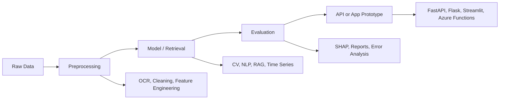

<div align="center">
  
</div>

<p align="center">
  <a href="https://github.com/Ditt-A">
    
  </a>
  <a href="https://www.linkedin.com/in/aditya-akbar-82a796274/">
    
  </a>
  <a href="mailto:aditya.akkbbar@gmail.com">
    
  </a>
</p>

<p align="center">
  
  
  
</p>

---

## System Profile

```txt
> boot aditya-akbar.profile

role        : Computer Science undergraduate, applied AI builder
location    : Malang, Indonesia
education   : Universitas Brawijaya
lab         : Intelligent Systems Laboratory, FILKOM UB

focus       : RAG systems, computer vision, NLP, time-series forecasting
builds      : source-grounded AI workflows, model experiments, production-style prototypes
```

<table>
<tr>
<td width="25%" align="center">

**6**

Highlighted AI projects

</td>
<td width="25%" align="center">

**3**

Competition results

</td>
<td width="25%" align="center">

**4**

Main AI domains

</td>
<td width="25%" align="center">

**Research**

IS Lab FILKOM UB

</td>
</tr>
</table>

---

## Core Stack

<p align="center">
  
</p>

| Track | Hard Skills |
| --- | --- |
| Machine Learning | Pandas, NumPy, Scikit-learn, LightGBM, SHAP, Captum, model evaluation |
| Deep Learning and CV | PyTorch, TensorFlow, Hugging Face Transformers, OpenCV, MONAI, Ultralytics, Mediapipe |
| NLP and LLM | Indonesian text preprocessing, RAG, FAISS, PostgreSQL, Gemini/OpenAI workflows, prompt orchestration |
| Backend and Deployment | FastAPI, Flask, Streamlit, Azure Functions, Docker basics, Git |

---

## Competition Achievements

<table>
<tr>
<td width="33%" valign="top">

### Finalist

**Data Analytics Competition at Find IT! 2026**<br/>
Universitas Gadjah Mada

Face spoofing detection for biometric security classification.

`Computer Vision` `Biometric Security`

</td>
<td width="33%" valign="top">

### Top 7 Finalist

**Datavidia Arkavidia 10.0**<br/>
Institut Teknologi Bandung

Multivariate time-series forecasting for ISPU category prediction.

`Time Series` `Forecasting` `ISPU`

</td>
<td width="33%" valign="top">

### 12th Place

**Machine Learning Competition Data Slayer 3.0**<br/>
Telkom University

Drowsiness detection using video-based machine learning.

`Machine Learning` `Video Analytics`

</td>
</tr>
</table>

---

## Project Console

<table>
<tr>
<td width="50%" valign="top">

### [BrainTumourSegmentation](https://github.com/Ditt-A/BrainTumourSegmentation)

MRI brain tumor segmentation research using U-Net and U-Net++ pipelines, comparative training reports, checkpoints, and prediction notebooks.

`Medical Imaging` `Segmentation` `PyTorch`

</td>
<td width="50%" valign="top">

### [DSNMUI_RAG](https://github.com/Ditt-A/DSNMUI_RAG)

Document-grounded RAG prototype for DSN-MUI fatwa search with BGE-M3 embeddings, BM25, RRF, reranking, visual dalil extraction, FastAPI, and Streamlit.

`RAG` `Hybrid Retrieval` `Qwen3-VL`

</td>
</tr>
<tr>
<td width="50%" valign="top">

### [Face-Spoofing-Detection](https://github.com/Ditt-A/Face-Spoofing-Detection)

Real/spoof face classification across printed, screen, mask, mannequin, unknown spoof, and genuine classes using ensemble deep vision branches.

`Computer Vision` `Anti-Spoofing` `Ensemble`

</td>
<td width="50%" valign="top">

### [Leksara](https://github.com/RedEye1605/Leksara)

Production-oriented Indonesian text preprocessing library for review pipelines, PII masking, slang normalization, and reusable dataset cleaning.

`Python Package` `Bahasa Indonesia` `NLP`

</td>
</tr>
<tr>
<td width="50%" valign="top">

### [AirSafe School](https://github.com/RedEye1605/airsafe-school)

Air quality prediction and recommendation system for DKI Jakarta schools using time-series features, LightGBM, Kriging, SHAP, and Azure Functions.

`Time Series` `Explainable ML` `Serverless`

</td>
<td width="50%" valign="top">

### [AI-MoodBand](https://github.com/Ditt-A/AI-MoodBand)

Local AI reflection app with Gemini, FAISS memory retrieval, daily summaries, optional image context, and safety-aware coaching responses.

`Flask` `Gemini` `FAISS`

</td>
</tr>
</table>

---

## Build Map



---

## GitHub Stats

<p align="center">
  
  
</p>

<p align="center">
  
</p>

<p align="center">
  <a href="https://github.com/Ditt-A?tab=repositories">
    
  </a>
  <a href="https://github.com/Ditt-A?tab=stars">
    
  </a>
</p>

---

<p align="center">
  <strong>Building applied AI systems that turn messy real-world data into inspectable, source-grounded, and usable tools.</strong>
</p>
